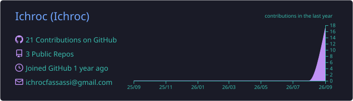
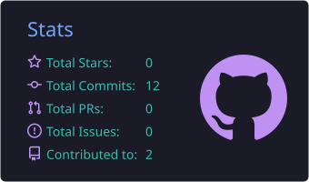

<div align="center">

<a href="#-disponibilité">
  
</a>
<br>
<a href="mailto:ichroc_fassassi@reseau.eseo.fr"></a>
<a href="https://www.linkedin.com/in/ichroc-fassassi"></a>


 
</div>

## 🖥️ `whoami`
 
```yaml
nom        : Ichroc FASSASSI
statut     : Étudiant ingénieur — 4ème année @ ESEO Angers
spécialité : Cloud, Systèmes & Sécurité
recherche  : 🎯 Stage technique — 17 semaines min. — dispo fin janvier 2027
domaines   : [Infra réseau, Cybersécurité (SOC/SIEM), Cloud & DevOps]
langues    : { français: C2, anglais: B2 (TOEIC 810) }
```
 
## 🚀 En ce moment
 
<table>
<tr>
<td width="62%" valign="top">
### 🛡️ SOC Open Source — Wazuh (SIEM/XDR)
<sub>📍 ESEO, Angers · depuis sept. 2026</sub>
 
Déploiement complet d'une chaîne de détection & réponse :
 
- 📥 **Collecte** — stack Wazuh (Manager, Indexer, Dashboard), agents multi-OS (Linux / Windows), enrichissement par flux de Threat Intelligence
- 🔍 **Détection** — modélisation de la menace avec **MITRE ATT&CK**, écriture de règles comportementales
- ⚡ **Réaction** — Active Response automatisée (blocage d'IP, désactivation de compte) + playbooks de réponse à incident
</td>
<td width="38%" valign="top" align="center">
<br>
<br>
<br>
<br>

 
</td>
</tr>
</table>
## 📂 Projets marquants
 
<table>
<tr>
<td width="33%" valign="top">
### ☁️ ESEO Teaching Cloud
<sub>Jan → Juin 2026</sub>
 
**Chef de projet & référent réseau** (équipe de 5). Architecture Cisco C3560, DMZ, routage inter-VLAN. IaC avec Vagrant + Ansible, supervision Zabbix, Kanban sur Gitea.
 


 
</td>
<td width="33%" valign="top">
### 🔎 SOC Wazuh
<sub>Depuis sept. 2026</sub>
 
Le projet phare du moment, orienté **détection & réponse** : de la collecte des logs jusqu'à la remédiation automatisée.
 


 
</td>
<td width="33%" valign="top">
### 🌐 IRDW
<sub>2024</sub>
 
Site web dynamique hébergé sur une infra **Debian**, base relationnelle MariaDB, accès SSH sécurisés et gestion fine des permissions.
 


 
</td>
</tr>
</table>
## 🧰 Stack technique
 
<div align="center">
<table>
<tr>
<td align="center"><b>🔐 Réseau & Sécurité</b></td>
<td>


</td>
</tr>
<tr>
<td align="center"><b>⚙️ Systèmes & Automatisation</b></td>
<td>


</td>
</tr>
<tr>
<td align="center"><b>☁️ Cloud & DevOps</b></td>
<td>


</td>
</tr>
<tr>
<td align="center"><b>🌐 Web & Data</b></td>
<td>


</td>
</tr>
</table>
</div>
## 🎓 Certifications
 
<div align="center">
<table>
<tr>
<td align="center" width="33%" valign="top">
<a href="https://github.com/Ichroc/Ichroc/blob/main/certifications/TOEIC_Score_Report_Ichroc_Fassassi.pdf">

</a>
**ETS Global**<br>
<sub>Listening 410 · Reading 400</sub><br>
<sub>Niveau **CEFR B2** · valide jusqu'au 04/12/2027</sub>
 
<a href="https://github.com/Ichroc/Ichroc/blob/main/certifications/TOEIC_Score_Report_Ichroc_Fassassi.pdf">

</a>
</td>
<td align="center" width="33%" valign="top">
<a href="https://certificats.candidat-cloe.com/check//F33F910F59EE825BBCF22AA4DFC76A10C5E25BE174D90318004838832F8B49CBMDdISEhUT3dXaE96SVN1YjUxdGhyVCswbmdWeVVSY3d4LzEydFJtcFBYcVVCbFh3">

</a>
**CCI France**<br>
<sub>Compétences Linguistiques Orales et Écrites</sub><br>
<sub>Certificat vérifiable en ligne</sub>
 
<a href="https://certificats.candidat-cloe.com/check//F33F910F59EE825BBCF22AA4DFC76A10C5E25BE174D90318004838832F8B49CBMDdISEhUT3dXaE96SVN1YjUxdGhyVCswbmdWeVVSY3d4LzEydFJtcFBYcVVCbFh3">

</a>
</td>
<td align="center" width="33%" valign="top">
<a href="https://certification.gestiondeprojet.pm/GdP25AP/GdP25PC-FAFcZuneA.pdf">

</a>
**Centrale Lille — R. Bachelet**<br>
<sub>Parcours Classique validé</sub><br>
<sub>Session 2025</sub>
 
<a href="https://certification.gestiondeprojet.pm/GdP25AP/GdP25PC-FAFcZuneA.pdf">

</a>
</td>
</tr>
</table>
</div>
## 📊 Activité GitHub
 
<div align="center">



<picture>
  <source media="(prefers-color-scheme: dark)" srcset="https://raw.githubusercontent.com/Ichroc/Ichroc/output/github-snake-dark.svg"/>
  <source media="(prefers-color-scheme: light)" srcset="https://raw.githubusercontent.com/Ichroc/Ichroc/output/github-snake.svg"/>
  
</picture>
</div>
## 🎯 Disponibilité
 
<div align="center">
> ### 📅 Stage technique — **17 semaines minimum** — à partir de **fin janvier 2027**
> 🖧 Infrastructure &nbsp;•&nbsp; 🛡️ Cybersécurité (SOC / Blue Team) &nbsp;•&nbsp; ☁️ Cloud & DevOps
 
<a href="mailto:ichroc_fassassi@reseau.eseo.fr"></a>
<a href="https://www.linkedin.com/in/ichroc-fassassi"></a>
 

</div>
 
