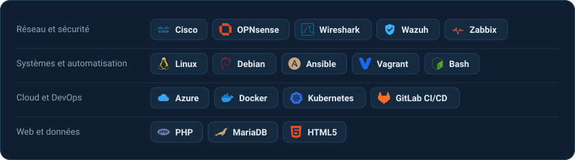
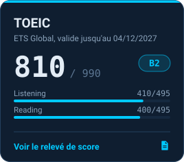
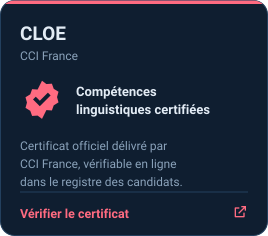
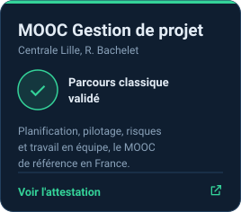
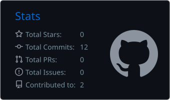
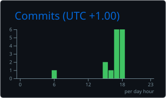

  

  
  

 

  

  

  
  
  

 

  
  

<picture>
  <source media="(prefers-color-scheme: dark)" srcset="https://raw.githubusercontent.com/Ichroc/Ichroc/output/github-snake-dark.svg">
  
</picture>
