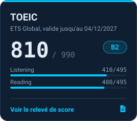
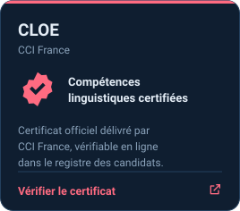
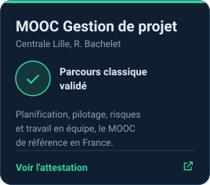

<!--
  README de profil, dépôt Ichroc/Ichroc.
  Les images assets/*.svg sont celles déjà présentes dans ton dépôt : rien à ajouter.
  Avant de publier : vérifie que soc-console.svg et parcours.svg ne disent plus « 4ème année ».
-->

<h1>Ichroc Fassassi</h1>

<b>Élève ingénieur en 5e année à l'ESEO Angers</b> 
Spécialité Cloud, Systèmes et Sécurité

<i>Je monte des réseaux, je déploie des serveurs, puis je cherche comment les défendre.</i>

 

> [!IMPORTANT]
> **Je cherche un stage de fin d'études** de 17 semaines minimum, à partir de fin janvier 2027.
> Domaines visés : SOC et détection, audit de sécurité, réseau et infrastructure, cloud et DevOps.
> Basé à Angers, ouvert à la mobilité.

## 🛡️ En ce moment : un SOC open source autour de Wazuh

Projet de fin d'études, de septembre 2026 à janvier 2027. Je suis **chef de projet d'une équipe de cinq** et je m'occupe aussi de la qualification des données.

Le SOC traite chaque événement en trois étapes :

| Étape | Ce qu'elle fait |
| :-- | :-- |
| **1. Qualification** *(mon rôle)* | Collecter les journaux des machines Linux et Windows, les normaliser, les enrichir avec des flux de threat intelligence |
| **2. Détection** | Relier les événements aux techniques MITRE ATT&CK, écrire des règles qui repèrent les comportements suspects |
| **3. Réaction** | Déclencher une réponse automatique (blocage d'adresse, désactivation de compte), suivre l'incident avec des playbooks |

`Wazuh` `SIEM / XDR` `MITRE ATT&CK` `Threat Intelligence` `Active Response`

## 📂 Projets

<!-- Quand un projet a son dépôt public, transforme son titre en lien : ### [Titre](https://github.com/Ichroc/NOM-DU-DEPOT) -->

### ☁️ ESEO Teaching Cloud (janvier à juin 2026)
Chef de projet et référent réseau, équipe de cinq. Une preuve de concept de plateforme « TP as a Service » : regrouper sur la ferme de serveurs de l'école les machines virtuelles utilisées en TP.
- Réseau découpé en VLAN, switch Cisco C3560, routage inter-VLAN, DMZ et pare-feu OPNsense
- Déploiement des machines automatisé avec Vagrant et Ansible
- Services MariaDB, DNS avec BIND9, supervision avec Nagios
- Livré en trois incréments, avec 79 tests de validation pour le service Gitea

### 🔐 Passerelle NAT et rebond SSH (septembre 2026)
Une machine passerelle protège un serveur qui n'a pas d'accès direct à Internet.
- NAT sortant avec iptables, règles rechargées à chaque démarrage
- Connexion SSH par clé, directe ou par rebond sur la passerelle
- Tunnels SSH locaux vers le web, MariaDB et FTP, et pourquoi le tunnel FTP seul ne suffit pas
- Une redirection volontairement non chiffrée, pour montrer dans Wireshark ce qu'un attaquant lit en clair

### 🐳 Un serveur web et sa base, en conteneurs (septembre 2026)
- Serveur web sur Alpine 3.22 avec Apache, PHP et DVWA
- Base MariaDB sur l'image officielle Alpine, jamais exposée sur le réseau
- Volumes dédiés, mot de passe passé par variable d'environnement, scripts build, start, stop et remove

### 🌐 Réseau multi-sites Paris et Angers
Deux sites configurés de bout en bout sur Cisco : VLAN et VTP, routage inter-VLAN, DHCP, EIGRP entre les sites, NAT/PAT, Wi-Fi WPA2. Livré avec sa documentation complète.

### 📝 [Cyber-writeups](https://github.com/Ichroc/Cyber-writeups)
Mes notes d'entraînement en cybersécurité, rangées par étapes.

## 🧰 Boîte à outils

| Domaine | Outils |
| :-- | :-- |
| **Réseau** | Cisco IOS, VLAN et VTP, EIGRP, NAT/PAT, OPNsense, iptables, Wireshark |
| **Sécurité** | Wazuh, MITRE ATT&CK, threat intelligence, réponse active, tunnels SSH |
| **Systèmes** | Linux (Debian, Alpine), Bash, Apache, MariaDB, BIND9, Nagios, Zabbix |
| **Cloud et DevOps** | Docker, Ansible, Vagrant, VirtualBox, Kubernetes, Azure, GitLab CI/CD |
| **Gestion de projet** | Deux projets menés comme chef de projet, livraison par incréments |

## 🎓 Parcours

<!-- Complète la ligne 2024 avec le nom complet de la formation et de l'établissement -->

| Quand | Quoi |
| :-- | :-- |
| 2024 | IRDW |
| Janvier à juin 2026 | ESEO Teaching Cloud, chef de projet et référent réseau |
| Depuis septembre 2026 | 5e année du cycle ingénieur ESEO, projet de fin d'études SOC Wazuh |
| Fin janvier 2027 | Stage de fin d'études, 17 semaines minimum |

Langues : français (C2), anglais (B2).

## 📜 Certifications

 

Un stage à proposer, une question sur un projet ? <a href="mailto:ichroc_fassassi@reseau.eseo.fr">Écrivez-moi</a>.

